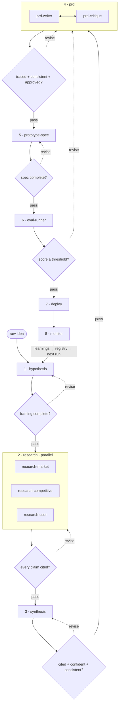
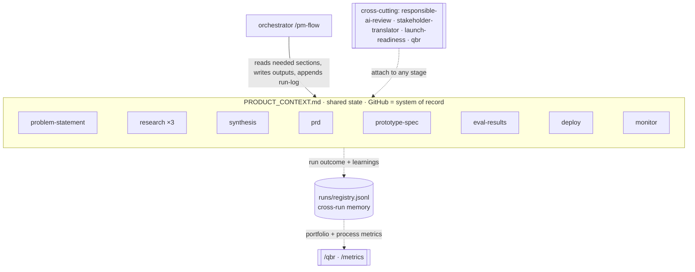
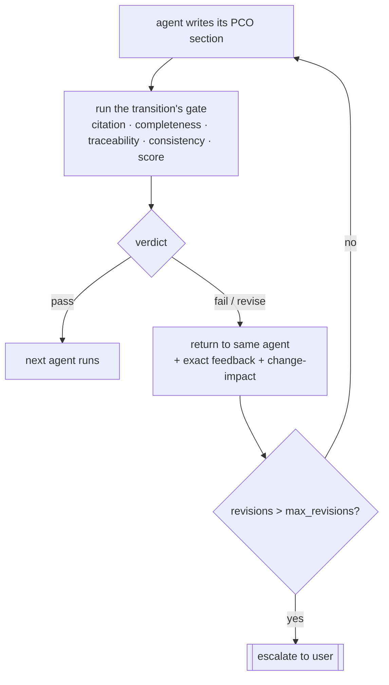
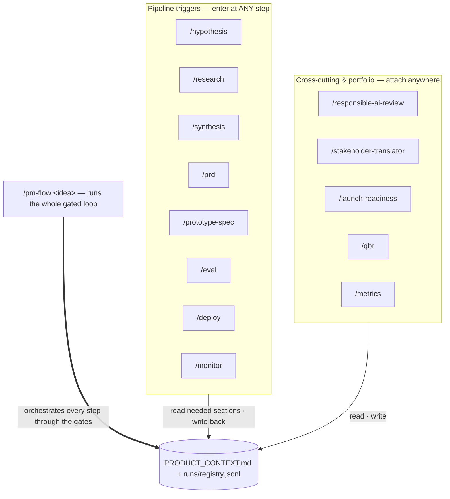

# Architecture

pm-flow is an **AI-native, eval-gated agentic pipeline** for product management. It drives a raw idea through a continuous loop — hypothesis → research → PRD → prototype → eval → deploy → monitor — where every handoff passes an **evaluation gate** before the next agent runs.

## Four primitives

1. **PCO (Product Context Object)** — `PRODUCT_CONTEXT.md`, the single shared-state file. Agents read the sections they need and write their output back; there is no copy-paste handoff. Schema: [pco-schema.md](pco-schema.md).
2. **Eval gate** — a validation checkpoint on every transition. It reads the PCO and runs composable checks (citation, completeness, traceability, **consistency**, **anchored score**): are claims cited? does the chain trace end-to-end? do sections contradict each other? does the score clear the rubric anchors? **Pass** → next agent. **Fail** → back to the same agent with feedback + a targeted change-impact note. Definitions: [eval-gates.md](eval-gates.md).
3. **Dual-mode agents** — one definition, two invocation paths. Each agent is a `skills/<name>/SKILL.md` (the knowledge + §7 contract) plus a `commands/<name>.md` (the standalone slash command). The orchestrator (`commands/pm-flow.md`) chains them into the loop. Mode is *how it's invoked*, not different logic.
4. **Cross-run memory** — `runs/registry.jsonl` records every run's outcome, scores, verdicts, and learnings. It turns the monitor→hypothesis feedback into real memory: `/qbr` builds a portfolio view from it, `/metrics` reports process health (gate-failure rates, revisions/stage), and the next run starts from prior learnings. See [`runs/README.md`](../runs/README.md).

## The loop



Shared state + cross-cutting agents — every pipeline agent reads/writes the PCO; cross-cutting agents attach to any stage:



### How one handoff passes a gate



## Triggers — start at any step

Every agent is **dual-mode**: it can run inside the orchestrated `/pm-flow` loop, or be triggered on its own. Because all state lives in the PCO, **you can enter at any step** — run `/synthesis` once research is in the PCO, `/eval` on an existing spec, `/qbr` over past runs. Two ways to trigger:

- **Auto-load (implicit):** a skill loads itself when the conversation topic matches its description (Claude Code reads each `SKILL.md` frontmatter). Just describe the task — the relevant agent's knowledge comes in.
- **Slash command (explicit):** invoke it directly. Force a specific skill with `/<skill>` or `/pm-agentic-flow:<skill>`.



**Trigger reference**

| Trigger | Starts | Reads → Writes (PCO) |
|---------|--------|----------------------|
| `/pm-flow <idea>` | the whole gated loop | `problem-seed` → all sections |
| `/hypothesis <idea>` | framing | `problem-seed` → `problem-statement` |
| `/research market\|competitive\|user\|all` | research | `problem-statement` → `research-*` |
| `/synthesis` | consolidation | `research-*` → `synthesis` |
| `/prd write\|critique` | the PRD loop | `synthesis` → `prd` |
| `/prototype-spec` | the build spec | `prd` → `prototype-spec` |
| `/eval` | anchored scoring | `prd`+`prototype-spec` → `eval-results` |
| `/deploy` | the handoff | `eval-results` → `deploy` |
| `/monitor` | post-launch loop | `deploy` → `monitor` (+ registry) |
| `/responsible-ai-review` | governance | `prd`+`prototype-spec` → `responsible-ai` |
| `/stakeholder-translator` | 3-audience comms | latest stage → `stakeholder-comms` |
| `/launch-readiness` | launch review | `deploy` → `launch-readiness` |
| `/qbr` | portfolio review | `runs/registry.jsonl` → `qbr` |
| `/metrics` | process health | `runs/registry.jsonl` → report |

A trigger simply refuses (with feedback) if its inputs aren't in the PCO yet — e.g. `/synthesis` before any research exists.

## Using it in Claude Code

```bash
# 1. install (once)
claude plugin marketplace add mazenelabdrawy/pm-agentic-flow
claude plugin install pm-agentic-flow@pm-agentic-flow
```

Then, inside Claude Code:

- **Run the full loop:** `/pm-flow A churn-risk early-warning tool for B2B SaaS CSMs` — it scaffolds the PCO and drives every gate to a handoff.
- **Start at one step:** `/hypothesis <idea>`, or `/synthesis` if research already lives in the PCO, or `/eval` to score an existing spec. State carries between calls via `PRODUCT_CONTEXT.md`, so solo runs and the loop mix freely.
- **Just talk:** describe what you're doing ("size the market for X") and the matching skill auto-loads; add `/<skill>` to force it.
- **Tune the bar:** edit `eval/rubric.yaml` (thresholds, anchors, confidence floor).
- **See the memory:** `/qbr` for a portfolio view, `/metrics` for where the pipeline bottlenecks.

(Cowork and other assistants: see [README](../README.md#-installation) — skills are portable; the `/slash` triggers are Claude-specific.)

## Why gates, not a skill grab-bag

Most PM AI tooling is a collection of independent skills — useful, but nothing stops a confident, unsupported claim from flowing straight into a PRD, and nothing remembers the last run. pm-agentic-flow's difference is the **gate between every stage** plus **memory across runs**: a synthesis insight resting on an uncited research claim *fails*; a PRD requirement with no backing finding is moved to open questions; two PCO sections that contradict each other (a niche ICP with a mass-market TAM) are flagged by the consistency check; a prototype scoring below the rubric **anchors** doesn't reach deploy; and every run's outcome + learnings land in `runs/registry.jsonl` so the next run starts smarter. The rigor is enforced by the structure, not left to discipline.

## Packaging

pm-flow ships as a **Claude Code / Cowork plugin marketplace**: a root `.claude-plugin/marketplace.json` registers the plugin, whose `commands/` and `skills/` are the dual-mode agents. This is what makes it one-command installable and contributor-extensible — adding an agent is adding a skill + a command. See [quickstart.md](quickstart.md) and [../CONTRIBUTING.md](../CONTRIBUTING.md).

## GitHub as the system of record

The PCO, PRD, eval results, and decisions all commit into the repo. A run's `run-log` is its audit trail: which agent ran, which gate it hit, and the verdict. The history *is* the product's decision record.
